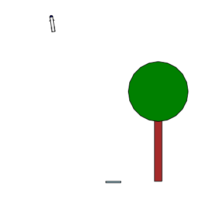

# `rockets`

<small>[Next: Introduction >>](/rockets/rockets/introduction)</small>   

`rockets` is a test-bed and 2D simulation of landing rockets using optimal control techniques.  The simulation is written in [Julia](https://www.julialang.org) and source code is located on [Github](https://www.github.com/freestatelabs/rockets).  

{:height="300px"} 

This project was of course inspired by the success of SpaceX landing their Falcon first stages: [https://youtu.be/sf4qRY3h_eo?t=440](https://youtu.be/sf4qRY3h_eo?t=440).  

The code currently includes a 3-degree of freedom simulation of a rocket, an LQR controller, and a module for visualization of the results.  The LQR controller has significant limitations, but under certain conditions enables excellent control of flight and landing of "scale-model"-sized rockets.  Current work is focusing on adding: 
- Properly tuned LQR controller for landing a full-size Falcon 9
- Model-predictive control as replacement/supplement to LQR 
- Continuous-time reinforcement learning algorithms to compare against classic LQR/MPC
