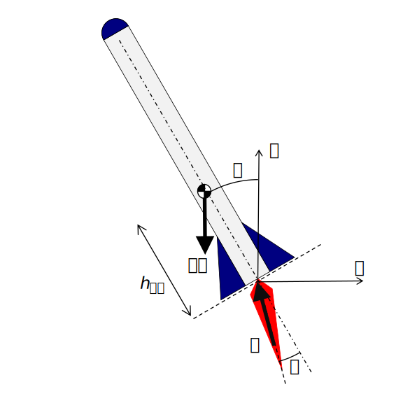

 
# `rockets`

<small>[<< Back: Introduction](introduction) | [Next: LQR Controller >>](lqr-controller) </small>

## Physics and State-Space Model

### Free Body Diagram and Equations of Motion 

Derivation of a model of the physics of this system is fairly straightforward and employed the following assumptions:
* Air resistance is negligible at the low velocities being simulated
* The mass moment of inertia of the rocket is calculated as that of a cylinder and is dependent only on the rocket's total mass, radius, and length 
* Center of mass of the rocket is varied for testing controller stability, but is generally assumed to be 1/3 of the length of the rocket from the base, as the rocket being modeled has minimal fuel remaining and the engine is a substantial portion of the rocket mass 
* The rocket has three degrees of freedom: horizontal translation, vertical translation, and rotation (planar motion) 
* Forces, moments, and angles have the positive sign conventions according to the figure and the right-hand rule 

It is easiest to imagine replicating this system physically by balancing a ruler on a pencil and sliding it down a frictionless wall.  In mathematical or classical-control terms, it is the inverted pendulum problem with the added complication that the base of the pendulum must also be controlled in 2D space. 

{:height="400px"}

Summing forces in the x- and y-directions, and summing moments about the centroid:

i$ \Sigma F_x = -T \cdot sin(\theta - \alpha) = m \ddot{x} i$  

i$ \Sigma F_y = T \cdot cos(\theta - \alpha) - m g = m \ddot{y} i$ 

i$ \Sigma M_{cg} = T \cdot sin(\alpha) \cdot h_{cg} = I_{cg} \cdot \ddot{\theta} i$

Note that a rocket exchanges mass for thrust, so:  

i$ \dot{m}_{fuel} = - \rho \cdot T i$  

where i$ \rho i$ is a proportionality constant with units `kg/N-s` and 
i$ m = m_{dry} + m_{fuel} i$.

### Controls 

The rocket has two controls - engine throttle i$ u i$ and nozzle angle i$ \alpha i$ - yet three degrees of freedom, so it is [*underactuated*](https://en.wikipedia.org/wiki/Underactuation).  However, it is still perfectly [*controllable*](https://en.wikipedia.org/wiki/Controllability), as I'll show later.  

To separate the controller problem from the description of the rocket, I define the following:  

i$ T = u \cdot T_{max} i$  

where i$ T_{max} i$ is defined by the lift-off mass and maximum lift-off acceleration for a given rocket under study.

### State-Space Model 

In general, for an LQR controller, the desired continuous-time state-space model is a set of linear matrix equations of the following form:  

i$ \dot{x} = A x + B u i$  
i$ y = C x + D u i$

where: 
* i$ x i$ is an `n`-length column vector of the state variables 
* i$ u i$ is an `r`-length column vector of the control inputs 
* i$ A i$ is a `n x n` matrix describing the dynamics of the plant to be controlled
* i$ B i$ is an `n x r` matrix describing the controller input 
* i$ C i$ is the `n x n` output matrix (assumed to be an identity matrix for this problem)
* i$ D i$ is an `n x r` feedforward matrix (null for this problem)

### Linearization of the State-Space Model 

However, the true plant dynamics are given by a set of seven coupled nonlinear differential equations, which cannot be placed into this state-space form directly. They are currently of the following form:  

i$ \dot{x} = f(x, u) i$  

To produce a linear model suitable for the LQR controller:
1. Nonlinear elements, such as i$ sin() i$ and i$ cos() i$, must be approximated by linear functions
2. The equations must be linearized about an equilibrium point 
 
At the equilibrium point, the dynamics (i.e. the column vector i$ \dot{x} i$) equals zero, and the state variables i$ x i$ and control inputs i$ u i$ are found to suit these conditions, i.e.

i$ 0 = f(\bar{x}, \bar{u}) i$  

Making the following variable substitutions and rewriting the equations of motion: 

$$ \mathbf{x} = \begin{bmatrix} x_1 \\ x_2 \\ x_3 \\ x_4 \\ x_5 \\ x_6 \\ x_7 \end{bmatrix}
= \begin{bmatrix} x \\ \dot{x} \\ y \\ \dot{y} \\ \theta \\ \dot{\theta} \\ m_{fuel} \end{bmatrix}
$$

$$
sin(x) \approx x, \quad cos(x) \approx 1
$$

Note a few things about this system of nonlinear equations:
* To achieve equilibrium, thrust angle must be zero and thrust must equal i$ mg i$
* The fuel mass flow rate must equal zero, but to do so requires thrust to equal zero 
* i$ I_{cg} i$ is dependent on variable i$ x_7 i$ (fuel mass)
* When making the [small-angle approximation](https://en.wikipedia.org/wiki/Small-angle_approximation), the error of the approximation is less than 5% at i$ 15^\circ i$

To linearize this system, I decided to consider the condition where either i$ \rho i$ was small and thus ignore the effects of mass change on the controller.  If the variability of system mass reduces the performance of the controller, then the control matrices can be updated when mass changes by a specified threshold. 

Thus, the linearized system is: 

$$ \mathbf{\dot{x}} = \begin{bmatrix} \dot{x} \\ \ddot{x} \\ \dot{y} \\ \ddot{y} \\ \dot{\theta} \\ \ddot{\theta} \\ \dot{m}_{fuel} \\ \end{bmatrix} = 

\begin{bmatrix}
    x_2 \\
    -\frac{u_1 \cdot T_{max}}{m_{dry} + x_7} \cdot (x_5 - u_2) \\
    x_4 \\
    \frac{u_1 \cdot T_{max}}{m_{dry} + x_7} \\ 
    x_6 \\ 
    \frac{u_1 T_{max}}{I_{cg}} \cdot h_{cg} \cdot \alpha\\ 
    - \rho \cdot u_1 \cdot  T_{max} \\
\end{bmatrix}
$$

With equilibrium point: 

$$ \bar{x} = \begin{bmatrix} any \\ 0 \\ any \\ 0 \\ 0 \\ 0 \\ \end{bmatrix} $$   

$$ \bar{u} = \begin{bmatrix} \frac{mg}{T_{max}} \\ 0 \end{bmatrix} $$  

and i$ x_7 i$ is no longer a state variable in the control matrix.  

The plant dynamics and controller matrices i$ A i$ and i$ B i$ are given by calculating the Jacobian of the linearized system evaluated at the equilibrium point, i.e. 

$$ A = \left. \begin{bmatrix}\frac{\partial{f_1}}{\partial{x_1}} & \dots & \frac{\partial{f_1}}{\partial{x_n}} \\ \dots & & \dots \\ 
\frac{\partial{f_n}}{\partial{x_1}} & \dots & \frac{\partial{f_n}}{\partial{x_n}}
\end{bmatrix}  \right\vert_{(\bar{x}, \bar{u})}
$$

$$ B = \left. \begin{bmatrix}\frac{\partial{f_1}}{\partial{u_1}} & \dots & \frac{\partial{f_1}}{\partial{u_r}} \\ \dots &  & \dots \\ 
\frac{\partial{f_n}}{\partial{u_1}} & \dots & \frac{\partial{f_n}}{\partial{u_r}}
\end{bmatrix}  \right\vert_{(\bar{x}, \bar{u})}
$$

After performing this calculation, the following continuous-time state-space model is derived:

$$ \dot{\mathbf{x}} = \begin{bmatrix} 0 & 1 & 0 & 0 & 0 & 0 \\ 0 & 0 & 0 & 0 & -g & 0 \\
        0 & 0 & 0 & 1 & 0 & 0 \\ 0 & 0 & 0 & 0 & 0 & 0 \\ 0 & 0 & 0 & 0 & 0 & 1 \\
        0 & 0 & 0 & 0 & 0 & 0 \\ \end{bmatrix} \mathbf{x} + 

        \begin{bmatrix} 0 & 0 \\ 0 & g \\ 0 & 0 \\ \frac{T_{max}}{m} & 0 \\ 0 & 0 \\ 0 & \frac{mg\cdot h_{cg}}{I_{cg}} \\ \end{bmatrix} \mathbf{u}

        $$

### Controllability 

I wrote earlier that this system is underactuated but controllable.  What I meant was that the system has 3 degrees of freedom but only two controls - it is impossible to always control each of the DOF individually without affecting the others.  However, the system is still [controllable](https://www.youtube.com/watch?v=u5Sv7YKAkt4); i.e. it can be steered to an desired final condition given an arbitrary initial condition, provided both are valid.  This is proven by computing the [controllability matrix](https://www.mathworks.com/help/control/ref/ctrb.html). 

The controllability matrix is defined as:

$$ CM = \begin{bmatrix} B & AB & A^{2}B & ... & A^{n-1}B \end{bmatrix} $$

where i$ A i$ is size `n x n`, i$ B i$ is size `n x r`, and i$ CM i$ is size `n x nm`.  If i$ CM i$ is rank `n` (`n`-independent column vectors), then the system is controllable.

Computing the controllability matrix yields:

$$
CM = 
$$

$$
\begin{bmatrix} 
0 & 0 & 0 & g & 0 & 0 & 0 & -\frac{m \cdot g^{2} \cdot h_{cg}}{I_{cg}} & 0 & 0 & 0 & 0 \\
0 & g & 0 & 0 & 0 &  -\frac{m \cdot g^{2} \cdot h_{cg}}{I_{cg}} & 0 & 0 & 0 & 0 & 0 & 0\\
0 & 0 & \frac{T_{max}}{m} & 0 & 0 & 0 & 0 & 0 & 0 & 0 & 0 & 0 \\
\frac{T_{max}}{m} & 0 & 0 & 0 & 0 & 0 & 0 & 0 & 0 & 0 & 0 & 0\\
0 & 0 & 0 & \frac{m \cdot g \cdot h_{cg}}{I_{cg}} & 0 & 0 & 0 & 0 & 0 & 0 & 0 & 0 \\
0 & \frac{m \cdot g \cdot h_{cg}}{I_{cg}} & 0 & 0 & 0 & 0 & 0 & 0 & 0 & 0 & 0 & 0\\
\end{bmatrix}
$$

Note the presence of six linearly independent column vectors - the system is controllable, from a mathematical perspective.  However, practicality considerations and external constraints not possible to place on an LQR controller will limit the ability to control the system well.
