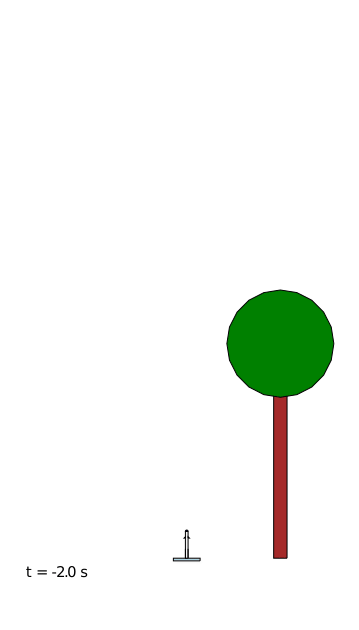
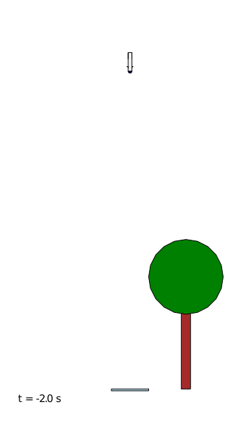

--- 
layout: default
use_math: true
---

# `rockets`

<small>[<< Back: Simulation](simulation) | [Next: References/Future Work >>](references-future-work) </small>

## Results

When using the 'scale-model' parameters (1m long, 1 kg rocket, 0.5g max vertical acceleration), the LQR controller proved to be fairly easy to tune by trial-and-error.  

### Multi-waypoint Flight 

The following example shows a flight with multiple waypoints - the rocket hovers at each waypoint, and then returns for a smooth landing at the launch pad.  

  

A couple of notes on this result:
* The 'drifting' of the rocket in the vertical plane (i.e. like the classic game *Asteroids*) is a result of the lack of noise and external disturbances in the simulation
* The LQR controller is fully capable of balancing the rocket and providing stable control even when significant horizontal motion is commanded  
* When making horizontal position adjustments, the rocket experiences large variations in vertical angle, which are undesirable from a flight safety perspective
* The LQR controller weights need additional tuning to provide a smoother flight

**Update (29 Jan 2021)**: I recently found some footage from [Masten Space](https://twitter.com/mastenspace) that shows maneuvering that looks similar to my simulation.  This can be seen around the 27s mark in [this](https://www.youtube.com/watch?v=oaXW5TaFwAE) video, at the 25s mark in [this](https://www.youtube.com/watch?v=qRFsGhti_D8) one, and on their [homepage](https://masten.aero/) background video as well.  Perhaps my simulation isn't too far off the mark. 

### Landing from Inverted Start 

One question I had when developing the linearized set of equations for the LQR  controller was this: since I used the small-angle approximation to make the controller, how robust would the controller be to large variations in the rocket angle?  I wasn't even certain that the rocket would fly correctly at all.

However, I found that the controller performed extremely well under these circumstances, even when the rocket started inverted!  

Note, however, that the success of the controller under these conditions results significantly from the ideal model of the rocket itself.  Some of these ideal conditions are:
* the rocket is short and light
* the thruster can instantaneously change thrust force and angle 
* drag forces and external perturbations are not fully modeled

