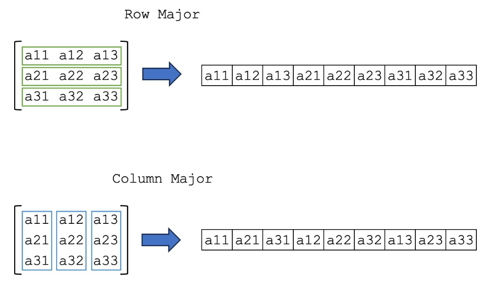

[<< Background](/wired-benchmarks/background) \| [Benchmarks >>](/wired-benchmarks/benchmarks)

## Basic Program
The simplest version of this Biot-Savart solver should execute a double loop over all sources
and all nodes to calculate the magnetic flux density `B`. The magnetic flux
density at each node is the sum of the contributions of all sources:
  
for source in sources:  
    for node in nodes:    
        B += biotsavart(source, node)   
  

In languages like C and Fortran, loops are very fast and this might be an 
effective method of writing the program. It's simple and quick. However, languages 
like Python (using NumPy) and Julia have built-in linear algebra routines that 
are normally optimized and faster than simple loops. Fortran, of course, does have
linear algebra routines built-in as well, but Fortran loops can be as fast if not faster
than these routines.

## SIMD Vectorization vs. Linear Algebra "Vectorization"
I want to make a distinction here between two methods of "vectorization" I'm using
in these benchmarks. CPU vectorization via SIMD (single-instruction, multiple data) 
refers to using the CPU as a vector processer, i.e. feeding it multiple pieces of data 
at once and asking it to perform the same operation on all pieces of the data simultaneously. 
Compilers like MSVC and GCC can automatically increase the speed of some operations 2-4x (or more, depending on the operation, data type, and CPU architecture) with built-in 
auto-vectorizers. For more information, see the following sources:

* MSVC documentation: [Auto-Vectorizers](https://learn.microsoft.com/en-us/cpp/parallel/auto-parallelization-and-auto-vectorization?view=msvc-170#auto-vectorizer)
* Stack Overflow: [Improving performance with SIMD intrinsics in three use cases](https://stackoverflow.blog/2020/07/08/improving-performance-with-simd-intrinsics-in-three-use-cases/) (using intrinsics)
* *[Vectorization and Parallelization of Loops in C/C++ Code](https://www.jsums.edu/robotics/files/2016/12/FECS17_Proceedings-FEC3555.pdf)* 

In contrast, with higher-level languages like Python and Julia, when I refer to 
"vectorization", I'm referring to converting a loop into a linear algebra matrix 
or vector operation, which NumPy refers to as "broadcasting". In Julia, this is 
not always faster (as loops in Julia are very fast), but can lead to faster and 
more efficient code due to lower-level optimizations not visible to the programmer.

## Data Structures
### Sources and Nodes 
Each program in each language starts with an Nx3 array of nodes, and a 7xM array of sources. The rows of `nodes` represent the $x,y,z$ coordinates of the locations at which the magnetic field should be calculated. The columns of `sources` represent an individual source vector, such that the first and second three elements of the column are the `x,y,z` coordinates of the start and end of the vector, respectively, and the 7th element is the current traveling along that vector in `amps`.

### Row vs. Column Major Array Order 
Julia and Fortran store arrays in *column-major* order, meaning that each column is stacked within a contiguous block of memory. Contiguous blocks of memory are very quick to access, because the system just needs to increment the memory address by one, rather than find the next item in memory somewhere else. In contrast, C stores arrays in row-major order, which is the default behavior of [NumPy `ndarrays`](https://numpy.org/doc/stable/reference/arrays.ndarray.html#index-1) as well. 

For best performance, it is absolutely critical to make sure that the arrays are structured in such a way that aligns the algorithm with the way that the data is represented in memory. For example, if all of the elements in an array must be modified in Julia, it is much faster to iterate along the columms, rather than along the rows, i.e.   

 for j in 1:Ncols
    for i in 1:Nrows
        A[i,j] *= 2 
    end
end


is faster than swapping the `i` and `j` indices, because the program is accessing the elements of the array along each column first.  

In C, the arrays are reversed, such that `nodes` is a 3-row x N column array, and `sources` is a M row x 3 column array. 

## Multi-Threading 
Each of the benchmarks was primarily intended as a single-threaded program, though 
multi-threaded/parallel processing is the ultimate goal. In Julia, this is accomplished 
using the built-in `Threads` library; in C and Fortran I used OpenMP, supported by 
both GCC and MSVC compilers. In Python, I used the multi-threading capabilities of 
Numba. 

### Modifying the Single-Threaded Program for Parallel Processing 
Since the basic forms of this program write to a single output array (a "reduction"), 
this program is not inherently thread-safe. If it executed using the automatic 
parallelization techniques in any of these four languages, a data race condition
would develop, where the output array could be read from and written to by multiple
threads simultaneously, causing errors in the result.  

To prevent this, I manually split the sources into "chunks" that would be operated 
on by individual threads simultaneously. At the end of the program, each thread 
sequentially writes to the output array, preventing this error. This means that 
the bulk of the work is performed simultaneously, though a bottleneck occurs at 
the beginning and end of the program. 

Now the pseudo-code looks like this: 
for thread in threads:  
    for source in chunk(thread, sources):
        for node in nodes:    
              B_partial += biotsavart(source, node)   
    
    # Force sequential write operation (i.e. `pragma omp critical`)
    B += B_partial
  

