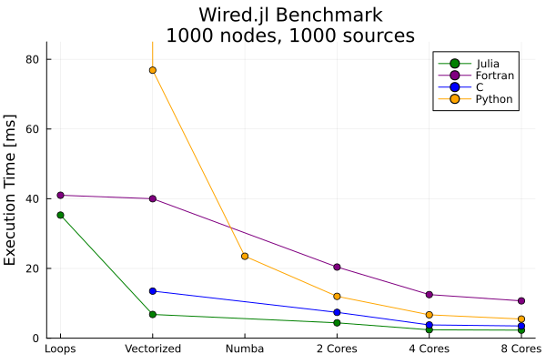

[<< Algorithm Design](/wired-benchmarks/algorithm-design) \| [Julia Implementation >>](/wired-benchmarks/julia)

## Languages and Optimization Levels
For this benchmark series, I chose to implement the code in the following languages:
* Julia 
* Python (using NumPy and Numba) 
* Fortran
* C 

Each of the languages has different capabilities, so I defined "optimization levels" 
to provide a fair comparison between them. The goal of the benchmark is to, in 
each individual language, produce the fastest possible code within the definition 
of each optimization level. 

Optimization Level | Julia | Python | Fortran | C 
--- | --- | --- | --- | ---
0 | - | Pure Python | - | -
1: Simple Loops | Simple loops | NumPy, simple loops | Simple loops | -
2: Vectorized | Vectorized | NumPy, vectorized | Vectorized | Simple Loops 
2+ | - | NumPy + Numba | - | - 
3: Multithreaded | `Threads` | Numba | OpenMP | OpenMP 

It was a bit tough to make sure this all fit into a rigid framework, due to how 
different these languages can be. C does not have built-in linear algebra libaries
(and it is outside the scope of this project to implement existing ones), while 
Python has multiple options in how to produce faster code.

## Software Versions and Hardware Used 
Julia: 1.10  
Python: 3.13, NumPy: 1.26.3, Numba: 0.59.0rc1  
GCC/Gfortran: 13.2.0 

All benchmarks were executed on a 2022 M1 MacBook Pro running MacOS Sonoma 14.2.1.

In Julia, benchmarks were obtained using the `BenchmarkTools.jl` package, which 
automatically runs the code for 10-1000x iterations and computes statistics on the
timing results. In Python, C, and Fortran, the benchmarks were obtained by timing the wall-clock 
execution of the program and taking the average over 100x iterations.

### Compiler Options

Minimal compiler options were used for this code; for example, for the C code:  
 gcc-13 -O3 -fopenmp benchmark.c wired.c -o benchmark.exe


The `-O3` flag uses GCC's highest optimization level (also used for the Fortran
implementation).

## The Benchmark Problem 
Consider a semi-infinite wire running along the z-axis at $x=y=0$, carrying 5 kA 
of current. Consider a number of points close to the $z=0$ plane at $x=y=3$. Find the 
magnetic flux density at each of these points. 

The analytical solution is that each of the output points should have very nearly 
the value
  
$$\vec{B} = (-1.667\cdot10^{-4}, 1.667\cdot10^{-4}, 0) \space[T] $$ 
  
Three computational problem sizes were chosen: 100 nodes x 100 sources, 1000 
nodes x 1000 sources, and 10000 nodes x 10000 sources. These levels were chosen 
to see if speed increases were linear as the memory required increased. 'Real' 
problem sizes might number in the hundreds of thousands or millions of both nodes 
and sources.  

Due to the speed of computation and the flexibility, I consider the 1000x1000 
problem to be the "baseline" assessment. When I was first writing the `Wired.jl` 
library, I was solving this problem in about 400ms.

## Benchmark Rules
1. Write code at the amateur/hobbist level: nothing too *fancy*. 
2. Write the fastest possible code using only the built-in libraries. 
3. Don't use `-ffast-math` optimizations.

## Results 
These results were very interesting and somewhat surprising to me: 

Let's start with the unsurprising: the C version was consistently very, very fast. 
The simplest version of the code solved the problem in about 13.5ms, which is 
faster than any of the other baseline implementations. Note that I placed this in the 
"vectorized" category, as I relied on the compiler's auto-vectorizer and did not 
make any serious compilation tweaks. 

Next up: Julia. Not surprisingly to me, once I figured out how to properly write
optimized code, it became the fastest implementation around, even faster than C. 
I credit this to the low-level optimizations built-in to the linear algebra library
in the language itself. Perhaps if I was more familiar with optimizing C code, 
they might be even more comparable. As-is, though - the Julia version solved the 
benchmark problem in 7ms, which is *57x faster* than my original implementation!

Now, Python. I expected this one to be by far the slowest, and it didn't challenge
that expectation much at first. Loops in Python are extremely slow, and for small 
problems, NumPy vectorization doesn't improve speed too much because of the overhead 
of moving back and forth between Python itself and the underlying NumPy C libraries. 
However, once Numba got involved, Python became much more competitive. It didn't 
challenge the C or Julia implementations, but consistently outperformed Fortran. 
Note that Numba has a precompilation time cost associated with execution, and each
time the program ran, it required about 2-4 seconds for precompilation. That's 
insignificant for very large problems, but for these benchmarks its far more time 
than the entire calculation. I gave it a pass here because of the very small size 
of the benchmark problems. If using Python from the interpreter shell or in a 
Jupyter notebook, this compilation time is only incurred once during the session.

Finally - Fortran. This is the language that I was least familiar with when starting
this project, and I think the results show it. It's not *slow* by any means, but 
it definitely could use some optimization improvements. I'm a lot more familiar 
with C, Python, and Julia than I am with Fortran, and I felt clumsy with the Fortran 
syntax and getting my code to work well. As expected, linear algebra and loops resulted
in roughly the same execution time. 

### Multi-threaded Performance 
For this problem, the multi-threaded performance improvements were roughly linear 
with the number of processor cores, until about 4-6 cores. Then, the overhead of 
moving data around locally and setting up the multi-threaded problem took over. For 
larger problem sizes, I expect that the performance will continue to scale linearly. 

Between languages, my Fortran implementation continued to be outperformed by the others. 
The Julia version was 2x as fast as the C version, and the C version was 1.5x as 
fast as the Numba version. It's quite impressive that Numba managed to chase the 
performance of the C version so well, and very interesting how adding this library
as a dependency and a few function decorators like `@njit()` to the existing code 
can improve performance so much.    